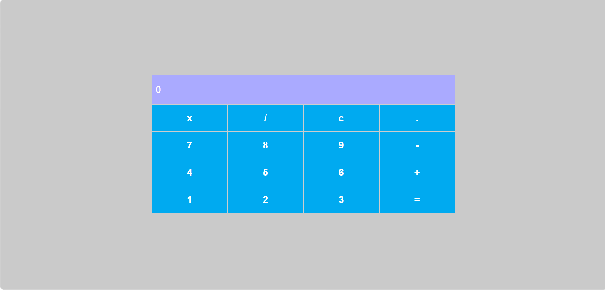

# 🧮 React Calculator Project

Este repositório apresenta uma **Calculadora funcional**, desenvolvida durante o curso de formação React da. O projeto foi criado com o objetivo de praticar a construção de interfaces dinâmicas, manipulação de estados e a lógica de operações matemáticas dentro do ecossistema React.

O projeto demonstra a transição do desenvolvimento estático para o dinâmico, utilizando **React.js** para gerenciar componentes reutilizáveis e uma interface interativa.

## 🚀 Objetivo do Projeto

O principal objetivo desta aplicação é consolidar os fundamentos do desenvolvimento com React, permitindo apresentar:
* Domínio de **Hooks (useState)** para gerenciamento de estado;
* Criação de componentes funcionais e reutilizáveis;
* Manipulação de eventos de clique e lógica de entrada de dados;
* Estilização moderna e alinhada com padrões de UI/UX;
* Integração de lógica JavaScript pura dentro de um framework SPA.

## 🎯 Funcionalidades

📌 Operações matemáticas básicas (Soma, Subtração, Multiplicação e Divisão)  
📌 Interface intuitiva simulando uma calculadora real  
📌 Botão de limpeza (Clear) para reiniciar cálculos  
📌 Histórico de entrada em tempo real no display  
📌 Layout responsivo e adaptável  
📌 Componentização total dos botões e display  

## 🛠️ Tecnologias Utilizadas

Este projeto foi desenvolvido utilizando as seguintes tecnologias:
* **React.js** → Biblioteca principal para construção da interface
* **JavaScript (ES6+)** → Lógica de programação e manipulação de dados
* **Styled Components** → Estilização e layout baseada em componentes
* **HTML5** → Estrutura base da aplicação

## 🧠 Conceitos Aplicados

Durante o desenvolvimento deste projeto, foram praticados conceitos importantes como:
* **Componentização**: Divisão da interface em partes menores e independentes.
* **State Management**: Uso do `useState` para refletir mudanças no display da calculadora.
* **Props**: Passagem de propriedades entre componentes (ex: rótulos dos botões e funções).
* **Event Handling**: Captura e tratamento de cliques do usuário.
* **CSS-in-JS**: Organização de estilos específicos para cada componente.

## 📂 Estrutura do Projeto

📦 Calculadora  
 ┣ 📂 public        # Arquivos públicos e ícones  
 ┣ 📂 src           # Código fonte da aplicação  
 ┃ ┣ 📂 components  # Componentes reutilizáveis (Button, Input, etc)  
 ┃ ┣ 📂 styles      # Arquivos de estilização global e temas  
 ┃ ┣ 📄 App.js      # Componente principal com a lógica de cálculo  
 ┃ ┗ 📄 index.js    # Ponto de entrada da aplicação  
 ┣ 📄 package.json  # Gerenciador de dependências  
 ┗ 📄 README.md     # Documentação do projeto  

## ▶️ Como Executar o Projeto

Para visualizar o projeto localmente, siga os passos abaixo:

1. **Clone este repositório**
git clone https://github.com/Lukinhax/Calculadora.git

2. **Acesse a pasta do projeto**
cd Calculadora

3. **Instale as dependências**
npm install

4. **Inicie a aplicação**
npm start

O projeto abrirá automaticamente no seu navegador no endereço: http://localhost:3000.

## 📸 Preview do Projeto

## 🔗 Acesse o Projeto

[👉 Clique aqui para visualizar o repositório](https://github.com/Lukinhax/Calculadora.git)

## 📈 Aprendizados com este Projeto

Com o desenvolvimento desta calculadora, pude reforçar e evoluir habilidades importantes como:

* Entendimento profundo do fluxo de dados unidirecional no React;
* Prática de lógica matemática aplicada à interface de usuário;
* Melhoria na organização de pastas e estrutura de projetos Front-End modernos;
* Implementação de boas práticas de código limpo e componentes independentes.

## 🎓 Contexto do Projeto

Esta calculadora foi desenvolvida como parte da Formação React da DIO, visando aplicar conhecimentos teóricos em um desafio prático, fortalecendo meu portfólio acadêmico e profissional como estudante de Sistemas de Informação no IFSP.

## 📌 Status do Projeto

✔️ Concluído 🚀  
Sujeito a melhorias futuras (como adição de funções científicas ou histórico de cálculos)
